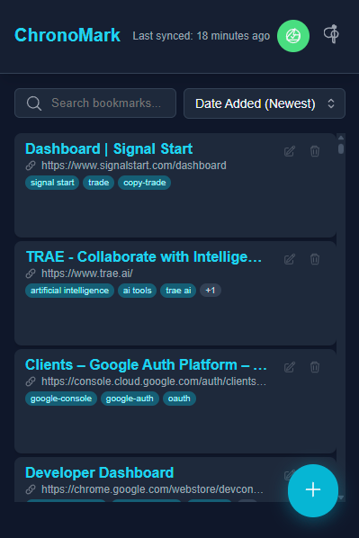
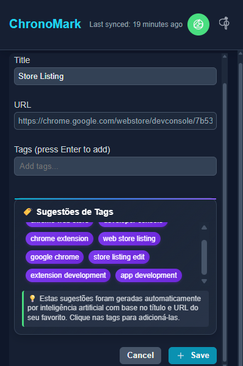
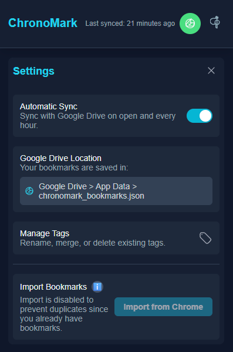
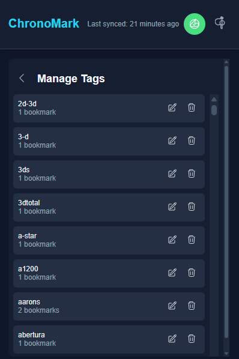

<div align="center">

# 🔖 ChronoMark - Smart Bookmark Manager

**Organize, synchronize, and find your bookmarks with artificial intelligence**

[](https://chrome.google.com/webstore)
[](https://github.com/flllexa/chronomark)
[](LICENSE)

*Transform the chaos of your bookmarks into an organized and intelligent library*

</div>

---

## ✨ Why ChronoMark?

**Tired of losing important bookmarks?** ChronoMark is the definitive solution for managing your favorites with **artificial intelligence**, **automatic synchronization**, and **tag-based organization**.

### 🎯 Key Features

- **🏷️ Smart Tagging System** - Organize bookmarks by custom categories
- **☁️ Google Drive Synchronization** - Your data, secure and accessible anywhere
- **🔍 Advanced Search** - Find any bookmark instantly
- **🤖 Integrated AI** - Automatic suggestions for tags and organization
- **📊 Detailed Statistics** - Track your browsing habits
- **🔒 Total Privacy** - Your data stays only with you

### 🚀 Unique Benefits

| Feature | ChronoMark | Standard Bookmarks |
|---|---|---|
| **Custom Tags** | ✅ Unlimited | ❌ Folders only |
| **Synchronization** | ✅ Google Drive | ❌ Limited |
| **Smart Search** | ✅ AI + Filters | ❌ Basic search |
| **Statistics** | ✅ Detailed | ❌ None |
| **Modern Interface** | ✅ Dark/Light | ❌ Basic |

---

## 🎬 How It Works

### 1. **Install and Configure**
```bash
# Clone the repository
git clone https://github.com/flllexa/chronomark.git
cd chronomark

# Install dependencies
make install

# Configure your Gemini API key
echo "GEMINI_API_KEY=your_api_key_here" > .env.local
```

### 2. **Build and Load in Chrome**
```bash
# Build the extension
make build

# Load in Chrome:
# 1. Go to chrome://extensions/
# 2. Enable "Developer mode"
# 3. Click "Load unpacked"
# 4. Select the 'dist' folder
```

### 3. **Configure OAuth (Optional)**
For Google Drive synchronization:
```bash
make oauth-setup    # Configuration guide
make oauth-test     # Test configuration
```

---

## 🛠️ Available Commands

### **Development**
```bash
make help           # Show all commands
make install        # Install dependencies
make build          # Build the extension
make dev            # Development mode
```

### **Chrome Web Store**
```bash
make package        # Create ZIP file for publishing
make store-info     # Store information
make store-help     # Publishing guide
```

### **OAuth & Configuration**
```bash
make oauth-setup    # Configure OAuth
make oauth-help     # Help with OAuth
make oauth-test     # Test configuration
```

---

## 📱 Screenshots

<div align="center">

### Main Interface


*Organize your bookmarks with smart tags*

### Bookmark Management


*Add and manage custom tags*

### Settings & Configuration


*Configure synchronization and preferences*

### Advanced Features


*Your data, safe in the cloud*

</div>

---

## 🔧 Technologies Used

- **Frontend**: React + TypeScript + Vite
- **Styling**: CSS Modules + Design System
- **Storage**: Chrome Storage API + IndexedDB
- **Sync**: Google Drive API
- **AI**: Google Gemini API
- **Build**: Makefile + Node.js

---

## 🤝 Contributing

1. **Fork** the project
2. **Clone** your fork: `git clone https://github.com/your-username/chronomark.git`
3. **Create** a branch: `git checkout -b feature/new-feature`
4. **Commit** your changes: `git commit -m 'Add: new feature'`
5. **Push** to the branch: `git push origin feature/new-feature`
6. **Open** a Pull Request

---

## 📄 License

This project is under the MIT license. See the [LICENSE](LICENSE) file for more details.

---

## 🆘 Support

- **📧 Email**: [support@chronomark.com](mailto:support@chronomark.com)
- **🐛 Issues**: [GitHub Issues](https://github.com/flllexa/chronomark/issues)
- **📖 Documentation**: [Project Wiki](https://github.com/flllexa/chronomark/wiki)

---

<div align="center">

**⭐ If ChronoMark helped you, leave a star on GitHub!**

*Made with ❤️ to organize the web*

</div>